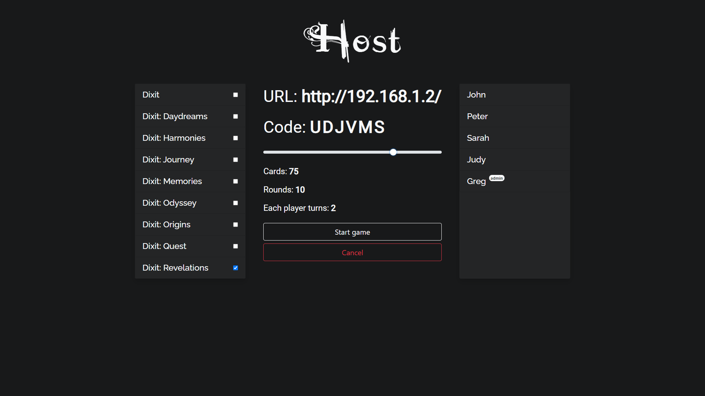
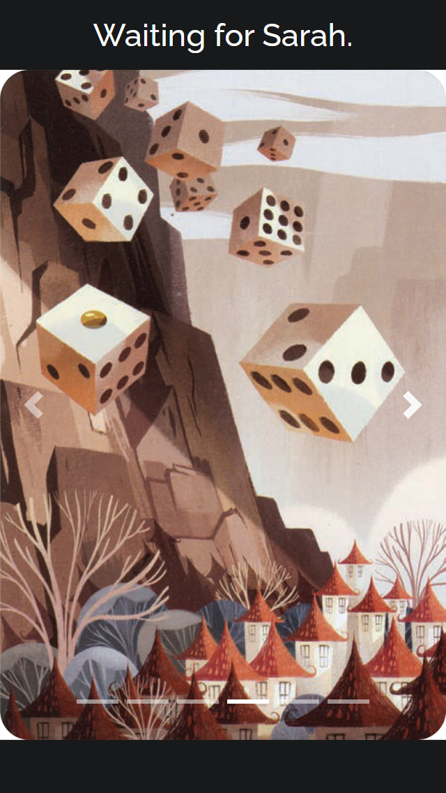
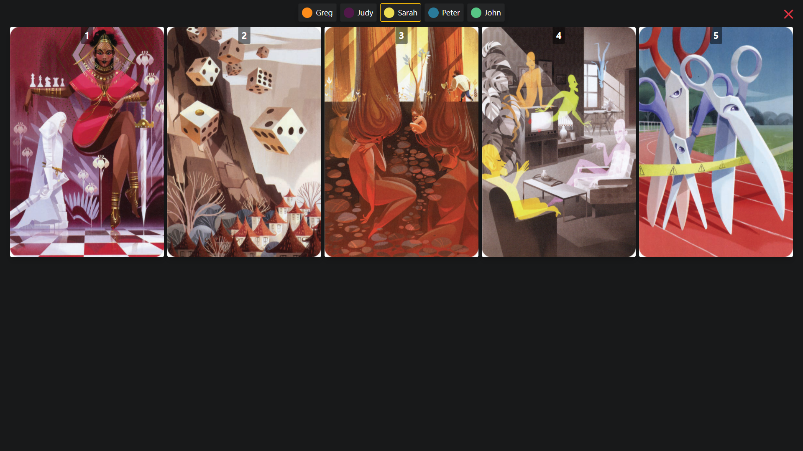
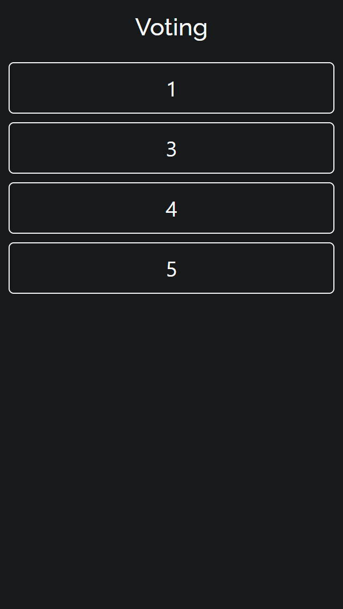
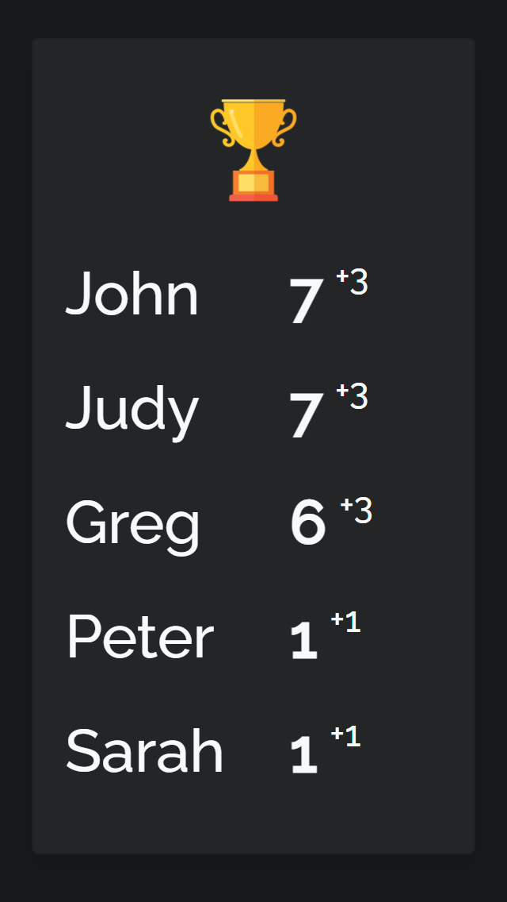

# Dixit (server)
This is the Dixit board game, LAN multiplayer version.
## Available Scripts
Install: `npm install`

Run: `node app.js`

Build: `node builder.js`
## Description
One device hosting (laptop or TV), the players join with their phones. (browser, with the host IP)
## Client
Directory **public/** contains the client application, built by [dixit-client](https://github.com/gregd98/dixit-client).
## Screenshots

